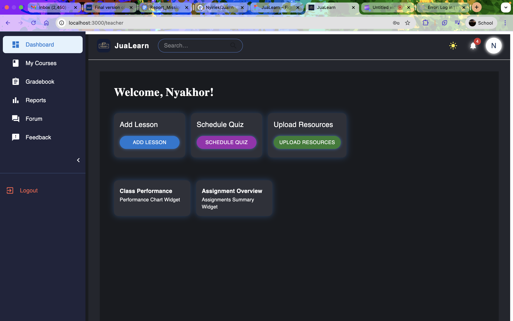
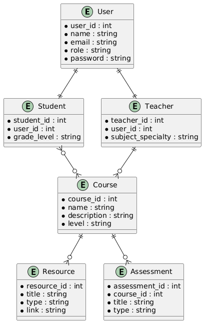

# JuaLearn – Empowering Secondary Education in South Sudan

JuaLearn is an AI-powered e-learning platform designed to provide high-quality educational resources tailored for secondary school students and teachers in South Sudan. The platform offers curriculum-aligned courses, interactive lessons, quizzes, assessments, and progress tracking — all delivered through a modern, responsive web application.

---

## Demo

* **[Demo Video (YouTube/Drive Link)](https://youtu.be/sA443Wir9mU)**
* **[Deployed website (Website link)](https://jua-lrn.onrender.com/)**

---

## Screenshots

> Full-size images and additional test cases are available in the `/testing-results/` folder.

| Dashboard (Student)                       | Mobile View                     | Dashboard (Teacher)                       | Dark Mode                         |
| ----------------------------------------- | ------------------------------- | ----------------------------------------- | --------------------------------- |
|  |  |  |  |

---

## Features

* Responsive user interface for desktop and mobile devices
* Role-based dashboards (Student, Teacher, Admin)
* Secure authentication using JWT tokens
* Dark/light mode toggle for user preference
* AI assistant integration (in progress)
* Subject enrollment and management
* Interactive quizzes with real-time grading and feedback
* Assignment creation, submission, and grading workflows
* Notification system for important updates and reminders


## Technology Stack

* **Frontend:** React, TypeScript, MUI (Material-UI), CSS Modules, Vite
* **Backend:** Django, Django REST Framework, SimpleJWT for authentication
* **Database:** PostgreSQL for production (SQLite used for local development)
* **Deployment:** Intended for Vercel/Netlify (frontend), Railway/Heroku/AWS EC2 (backend)
* **Design:** Figma ([Design link](https://www.figma.com/design/k6Yv3nJTRARvB16VVmGkW2/JuaLearn?t=PWEJQoeGFeT8JZzf-1))


## Installation & Setup

### Prerequisites

* Node.js (version 18 or higher) and npm/yarn
* Python 3.10 or higher and pip
* PostgreSQL (recommended) or SQLite for development

### Clone the repository

```bash
git clone https://github.com/Nyiriek/Jualrn.git
cd Jualrn
```

### Backend Setup

```bash
cd ../jualearn_backend
python -m venv venv
source venv/bin/activate  # On Windows use: venv\Scripts\activate
pip install -r requirements.txt
cp .env.example .env      # Customize environment variables here

# Apply migrations and create superuser
python manage.py migrate
python manage.py createsuperuser

# Start backend server
python manage.py runserver
```

### Frontend Setup

```bash
cd ./Jualearn
npm install
npm run dev
```


## UML Diagrams & Database Schema

### Use Case Diagram


### Entity Relationship Diagram



### Database Tables Overview

* **User:** id, username, email, password, role, first\_name, last\_name, profile\_picture, institution, years\_of\_experience, phone\_number
* **Subject:** id, name, description, created\_by, published
* **Assignment:** id, title, description, subject, created\_by, assigned\_to, due\_date, published, grade
* **Quiz:** id, title, description, subject, created\_by, due\_date, published
* **QuizQuestion:** id, quiz, text, type
* **QuizChoice:** id, question, text, is\_correct
* **Enrollment:** id, student, subject, enrolled\_at


## Testing

* Tested on Chrome, Firefox, and Android browsers.
* Performance verified on both high-end and low-end devices.
* Screenshots and logs available in `/testing-results`.


## Project Status & Analysis

* Core features like authentication, subject enrollment, assignment and quiz management, and notifications are implemented.
* AI assistant is a work in progress and will enhance personalized learning.
* Responsive UI delivers consistent experience on mobiles and desktops.


## Future Enhancements

* Offline learning support and SMS notifications.
* AI model training with curriculum content.
* Multi-language support for broader reach.
* Performance optimizations for low bandwidth networks.
* Mobile app (APK) for offline-first access.


## Contact

For questions, feedback, or contributions, please contact:
**[n.peat@alustudent.com](mailto:n.peat@alustudent.com)**

