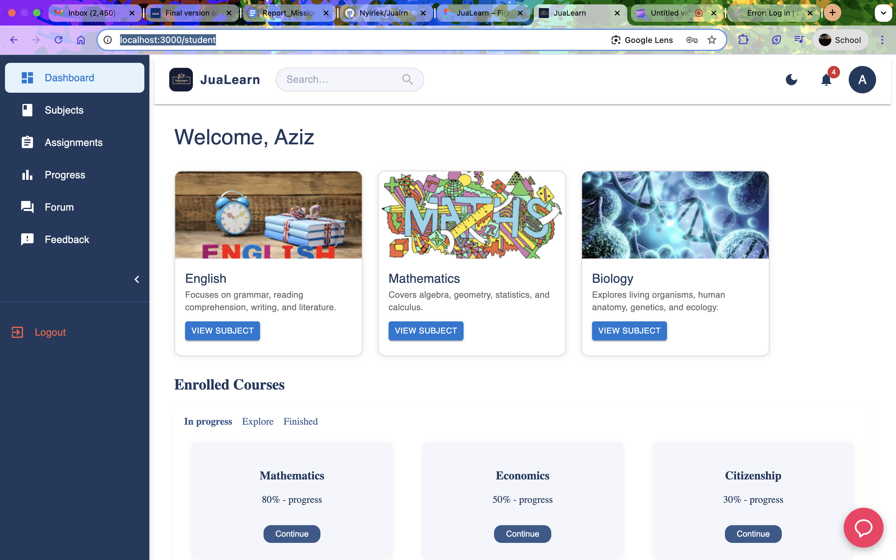
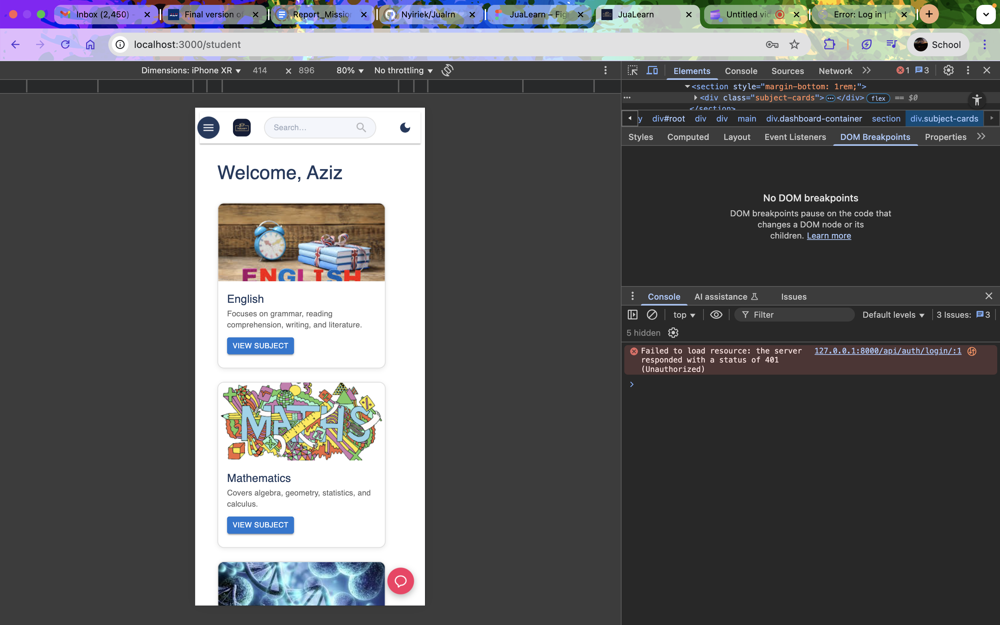
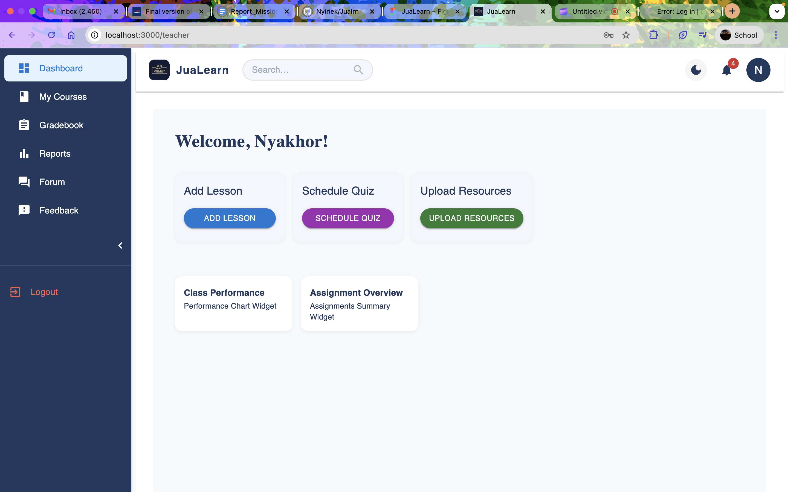
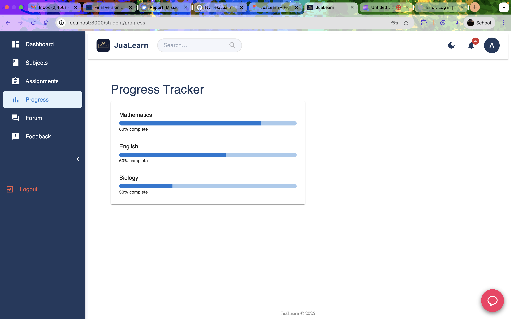
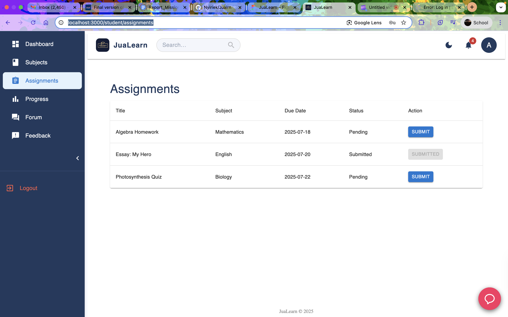

## JuaLearn – Empowering Secondary Education in South Sudan

JuaLearn is an AI-powered e-learning platform designed to provide high-quality educational resources for secondary school students and teachers in South Sudan. The platform offers curriculum-aligned courses, interactive lessons, assessments, and progress tracking, all through a modern, responsive web application.


## Demo

- **[Demo Video (YouTube/Drive Link)](https://www.youtube.com/watch?v=BMOncSmaMIA)**

-**The website has not been deployed yet because it is still under production, so there is no deployment link**

---

## Screenshots

> See the `/testing-results/` folder for full-size images and extra test cases.

| Dashboard (Student) | Mobile View | Admin Dashboard | Error Handling |
|---------------------|-------------|-----------------|---------------|
|  |  |  |  |  |  | ![]
(testing-results/darkmode.png)

---

## Features

- Responsive UI for desktop and mobile
- Role-based dashboards (Student, Teacher)
- Authentication (JWT)
- Dark/light theme toggle

---

## Technologies Used

- **Frontend:** React, TypeScript, MUI (Material-UI), CSS Modules
- **Backend:** Django, Django REST Framework, SimpleJWT
- **Database:** PostgreSQL (or SQLite for local dev)
- **Deployment:** Vercel/Netlify (frontend), Railway/Heroku/AWS EC2 (backend)
- **Design:** Figma (see `/designs/`)

---

## Installation & Setup

### Prerequisites

- Node.js (18+), npm/yarn
- Python 3.10+, pip
- PostgreSQL or SQLite

### 1. Clone the repository

```bash
git clone https://github.com/Nyiriek/Jualrn.git
cd Jualrn
````

### 2. Backend Setup

```bash
cd jualearn_backend
python -m venv venv
source venv/bin/activate  # (or venv\Scripts\activate on Windows)
pip install -r requirements.txt
cp .env.example .env  # Edit .env with your secrets

# Migrate and seed database (optional)
python manage.py migrate
python manage.py createsuperuser  # For admin access

# Run server
python manage.py runserver
```

### 3. Frontend Setup

```bash
cd ../frontend
npm install
npm run dev
```

---

## Database Schema

> *(Add or link to your ER diagram/image here, or describe major tables)*

* **User:** id, username, email, password, role, first\_name, last\_name, profile\_picture
* **Subject:** id, name, description
* **Assignment:** id, title, description, subject, created\_by, assigned\_to, status

---

## Testing Results

* Screenshots of passed tests and error cases can be found in the [`/testing-results`](./testing-results) folder.
* Tested on Chrome, Firefox, and Android browser.
* Performance tested on both high-end and low-end devices.

---

## Analysis

* **Objectives met:** Dashboard loads successfully for all roles; subject/assignment management works; authentication is secure.
* **Limitations:** The AI assistant isn't fully functional yet since it requires curriculum aligned content for training.
* **Responsiveness:** Fully functional on mobile and desktop (see screenshots).

---

## Discussion

* Milestone 1 (UI & Navigation) enabled rapid onboarding for students and teachers.
* Assignment and subject workflows empower remote learning and easy content updates.
* Admin dashboard simplifies management of users and content (Not yet fully functional).

---

## Recommendations & Future Work

* Integrate offline learning and SMS notifications.
* Continue training the AI model on the curriculum content
* Add support for more languages.
* Further optimize for ultra-low bandwidth.
* Build a mobile app (APK) for offline-first users.

---

## Contact

Questions? Suggestions? Contact me at n.peat@alustudent.com(mailto:your.email@domain.com)
